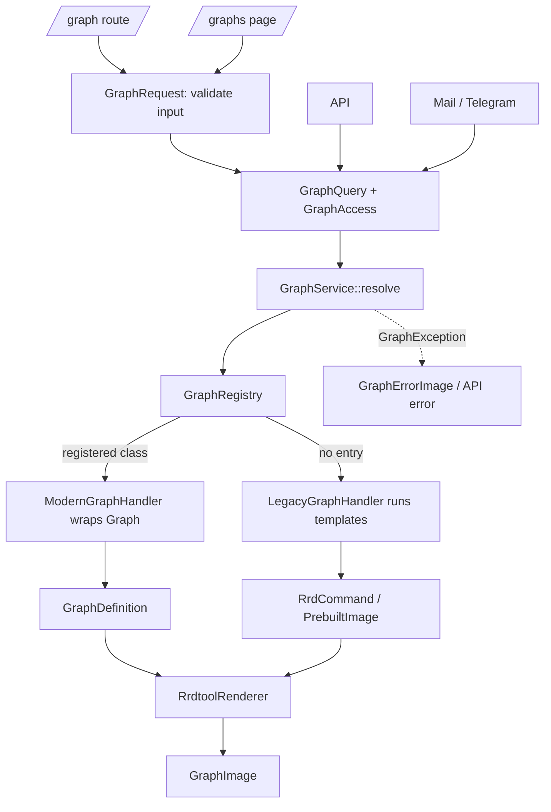
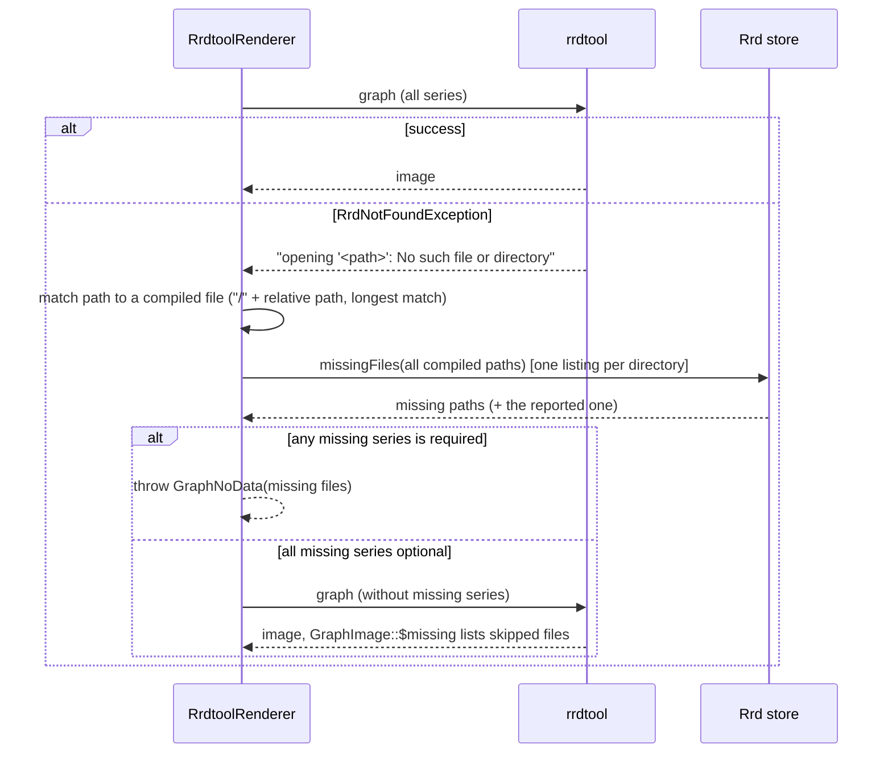

# Graph Rendering & Time Series Design

> **Document Status**: Living design reference, in progress
> **Scope**: Graph rendering (`app/Graphing`, `app/Graphs`), time series naming (`app/TimeSeries`), and the
> poller write path for metrics (`LibreNMS/Data/Store/Rrd.php`)
> **Last updated**: 2026-10-06

This document is the reference for moving graph rendering off the legacy `includes/html/graphs` templates.
It records the target design, the rules that keep the work consistent across branches, the decisions made
so far, and what is left to do. Update it when a decision changes.

---

## 1. Goals

1. **One graph rendering entry point.** Every caller (`/graph`, `/graphs` page, API, alert transports, Blade)
   goes through `GraphService`, which owns graph resolution, access control, and error translation; HTTP input
   validation happens in `GraphRequest` before the service is called. During the migration there are still two
   rendering paths behind that entry point: legacy templates and modern graph classes.
2. **Graphs describe presentation, renderers draw.** A graph class says which metrics to show and how to present
   them. Renderers decide how to produce the output (rrdtool today, possibly JSON for client side charts later).
3. **Explicit trust.** Whether a graph is rendered for a user or for a context authenticated some other way
   (signed URL, unauthenticated graph access, alerts) is passed in as a constrained value, never inferred.
4. **Error handling instead of existence checks.** Modern graphs draw first and react to rrdtool reporting a
   missing file, instead of checking every file before drawing.
5. **Readers and writers agree on storage names.** Pollers and graphs name rrd files through the same metric
   classes. A poller that explicitly names its metric either writes where graphs read or fails loudly.
6. **Incremental migration.** Legacy templates keep working unchanged and graphs move over one at a time,
   each reversible.

### Non-goals

- Fixing legacy graph templates. They have many issues; this work keeps their behaviour, it does not repair it.
- Replacing rrdtool, or changing how other datastores (InfluxDB, Prometheus, Graphite, ...) name data.
- Client side charting. The design leaves room for it (section 4.8), it is not part of this work.
- Migrating existing rrd files. Metric classes must match today's file names exactly.

---

## 2. Background

Before this work, graph rendering had these problems:

- Graph logic lived in PHP include files (`includes/html/graphs/<type>/<subtype>.inc.php`), run inside a method
  and communicating through dozens of loose variables.
- Authorization was in per-type `auth.inc.php` files, and duplicated between the graph image route and the graphs
  page, with the copies drifting apart.
- Guests were trusted by checking `Auth::guest()`, which is only safe because a middleware ran first.
- Templates checked every rrd file existed before drawing (`Rrd::checkRrdExists()`), one round trip per file
  under rrdcached.
- The poller and the graph templates each built rrd file names independently. A mismatch shows up only as an
  empty graph.

---

## 3. Architecture



Order of operations for an HTTP graph request:

1. **Parse**: `GraphRequest` merges legacy path vars into the input.
2. **Access established**: `GraphRequest::authorize()` only checks that a `GraphAccess` exists (a logged in user,
   or a guest the `AuthenticateGraph` middleware trusted). It does not touch graphs, subjects, or the database.
3. **Validate**: base rules plus the graph's own `rules()` (looked up by type name only, no subject).
4. **Resolve** (`GraphRequest::passedValidation()` calling `GraphService::resolve()`):
   1. **Handler**: `GraphRegistry` returns a modern handler for registered graphs, a legacy handler when a
      template exists, otherwise throws `UnknownGraph`.
   2. **Subject**: the handler resolves the entities the graph is about (`GraphSubject`), once.
   3. **Authorize**: trusted access passes; user access is checked. Failure throws `GraphUnauthorized`.
5. **Plan**: on render, the handler produces a `RenderPlan` (`GraphDefinition`, `RrdCommand`, or `PrebuiltImage`).
6. **Render**: `RrdtoolRenderer` draws the plan into a `GraphImage`.

Non HTTP callers (API, alert transports) build a `GraphQuery` themselves and start at step 4.

The result of step 4 is a `ResolvedGraph`, which can then `description()`, `render()`, or `command()` (the
rrdtool command for the graphs page "Show RRD Command"). The plan is computed once per `ResolvedGraph`.

### Namespaces

| Namespace | Contents |
|---|---|
| `App\Graphing` | Service, registry, query, access, trust, subject, description, image, error image |
| `App\Graphing\Contracts` | `Graph` (modern graphs), `GraphHandler`, `RenderPlan` |
| `App\Graphing\Definition` | `GraphDefinition`, `Series`, `Axis`, `Layout` |
| `App\Graphing\Exceptions` | Graph domain exceptions |
| `App\Graphing\Legacy` | `LegacyGraphHandler`, `LegacySubject`, `LegacyTemplateRunner` |
| `App\Graphing\Modern` | `ModernGraphHandler` |
| `App\Graphing\Plans` | `RrdCommand`, `PrebuiltImage` |
| `App\Graphing\Rrd` | `RrdtoolRenderer`, `RrdtoolCompiler`, `CompiledGraph`, `CompiledSeries`, `Palette`, `Layouts\*` |
| `App\Graphs\<Type>` | Concrete graph classes, e.g. `App\Graphs\Device\ProcessorGraph` |
| `App\TimeSeries` | `Metric` interface, `Metrics\*` metric classes, path resolver, exceptions |

---

## 4. Components

### 4.1 GraphQuery

`App\Graphing\GraphQuery` is the typed, transport level graph request: `type`, `subtype`, `ids`, `deviceId`,
`from`, `to`, `width`, `height`, `format`, and the raw `vars`.

- `GraphQuery::fromVars(array|string $vars)` is the only parser of raw graph vars. It accepts a vars array or a
  legacy graph URL/path. Parsing rules come from `GraphParameters`, so there is one set of rules.
- **Structural guarantees**: `type`/`subtype` match `[A-Za-z0-9]+_.+` and are reduced with `basename()`;
  `ids` contains only integers (non numeric parts are dropped); `deviceId` is an integer or null. A graph's
  `subject()` can rely on these without further checks.
- `parameters()` returns a **fresh** `GraphParameters` every call. Legacy templates mutate it, so it must never
  be shared between renders.
- `with(array $overrides)` returns a modified copy.
- **Scope rule**: `GraphQuery` only holds request level information common to all graphs. Graph specific options
  are validated by the graph's `rules()` and read in `define()`; do not add fields for them here. The raw `vars`
  field exists for legacy templates and should not be used by new code.

### 4.2 GraphAccess and the trust model

`App\Graphing\GraphAccess` says who a graph is rendered for:

- `GraphAccess::user(User $user)`: permissions are checked.
- `GraphAccess::trusted(GraphTrust $trust)`: the caller was authenticated by the mechanism named by the
  `App\Graphing\GraphTrust` enum, permission checks are skipped.

| `GraphTrust` case | Established by |
|---|---|
| `SignedUrl` | `AuthenticateGraph` verified a signed URL |
| `UnauthGraphs` | `AuthenticateGraph` allowed the client by `allow_unauth_graphs` / `allow_unauth_graphs_cidr` |
| `Alert` | Alert transports rendering graphs embedded in alert templates (admin controlled) |

Adding a trust reason means adding an enum case, which makes new trusted paths visible in review.

| Caller | Access | Set by |
|---|---|---|
| `/graph` logged in user | `user` | `GraphAccess::fromRequest()` |
| `/graph` signed URL guest | `trusted(SignedUrl)` | `AuthenticateGraph` sets the `graph_trust` request attribute |
| `/graph` `allow_unauth_graphs` / CIDR guest | `trusted(UnauthGraphs)` | `AuthenticateGraph` |
| `/graphs` page | `user` | route requires login |
| API | `user` (API token user) | `GraphAccess::fromRequest()` |
| Mail / Telegram alert transports | `trusted(Alert)` | caller passes it explicitly |
| `Graph::getImage()` default, `@graphImage` | `GraphAccess::current()` (logged in user, else unauthorized) | |

**Rule:** never derive trust from `auth()->guest()` or similar. A guest request without the `graph_trust`
attribute is rejected (`GraphAccess::fromRequest()` throws `GraphUnauthorized`).

Legacy graphs check permissions with functions that read the logged in user, so `LegacyGraphHandler` refuses
user access for any user other than `Auth::user()` (`LogicException`). This prevents rendering a graph "as"
one user while legacy code checks another.

### 4.3 GraphService, ResolvedGraph, GraphRequest

- `GraphService::resolve(GraphQuery, GraphAccess): ResolvedGraph` and `render()` (resolve then render).
  Both throw `GraphException`.
- `ResolvedGraph` holds the handler, subject, and query; `description()` returns a `GraphDescription`
  (title, subtitle, device, port) used by the graphs page.
- `App\Http\Requests\GraphRequest` (used by `/graph` and `/graphs`):
  - `authorize()` only checks that access is established (section 3, step 2).
  - `rules()` merges base rules with the graph's own `rules()` from the registry (by type name).
  - `passedValidation()` resolves the graph, so subject resolution and authorization only ever see valid input,
    and the result is reused by the controller.
  - On the image route (`routeIs('graph')`) failures throw `GraphException`, which renders an error image.
    On the graphs page they keep normal behaviour: validation errors redirect, resolution failures are 403.
  - `graphQuery()`, `access()`, `graph()`, `toVars()`.

**Invariant:** `subject()` only consumes input that passed validation. Invalid input therefore reports
"Invalid Input", never "Not Found" or "No Auth", and causes no database work.

### 4.4 GraphRegistry

`App\Graphing\GraphRegistry` maps graph names (`type_subtype`) to classes.

- The map is explicit: `App\Providers\GraphServiceProvider::GRAPHS`. No discovery.
- Entries may be a `Graph` (wrapped in `ModernGraphHandler`) or a `GraphHandler`.
- Graphs not in the map fall back to `LegacyGraphHandler` when the legacy template exists.
- **Rollback lever:** removing a map entry reverts that graph to its legacy template.
- `types()` and `subtypes()` back `LibreNMS\Util\Graph::getTypes()/getSubtypes()`, so ported graphs still
  appear in menus and selectors even after their legacy template is deleted.
- Names are validated (`/^[a-z0-9]+_[a-zA-Z0-9_-]+$/`); legacy lookups reject path traversal.

### 4.5 Legacy graphs

`App\Graphing\Legacy\LegacyGraphHandler` runs `includes/html/graphs/<type>/auth.inc.php`, then
`<subtype>.inc.php` (or `generic.inc.php`). **The variable contract with templates is identical to the original
implementation; templates are not changed.**

- **Initial variables**: `vars`, `device` (from `device` var, or single id for `device`/`port` types),
  `port`, `graph_params`, `type`, `subtype`, `height`, `width`, `from`, `to`, `period`, `prev_from`,
  `inverse`, `in`, `out`, `float_precision`, `title` (bool), `nototal`, `nodetails`, `noagg`, `graph`,
  `rrd_options`, `rrd_filename`, and `auth` (true for trusted access).
- **Shared scope**: `LegacyTemplateRunner` runs the auth file and the template inside one generator, so they share
  a single variable scope. Templates rely on everything the auth file defined, including references created by
  `global` (e.g. `bill/auth.inc.php` does `global $dur`). Copying variables between scopes breaks this.
- **Subject**: device and port come from the request first, then from what the auth file set (Device model or
  legacy array). A string `$title` set by the auth file becomes the page subtitle; `$graph_title` the title.
- **jpgraph**: bill historic templates draw with jpgraph and stream the image. Output is captured with output
  buffering and returned as a `PrebuiltImage`.
- **No data**: legacy templates keep their own `checkRrdExists()` calls. If rrdtool reports a missing file,
  the result is `GraphNoData`.
- Legacy includes are loaded and the working directory is set to the install root while templates run.
- A template throwing `RrdGraphException` becomes `GraphRenderFailed` with the same message and short text.

**Authorization is temporarily in two systems.** Legacy graphs authorize in their `auth.inc.php`; modern graphs
use Laravel policies. Each graph uses exactly one of them, and a graph moves to policies when it is ported.
The two can disagree for the same entity until all graphs of a type are ported.

### 4.6 Modern graphs

A modern graph implements `App\Graphing\Contracts\Graph`, usually by extending `App\Graphing\BaseGraph`:

```php
interface Graph
{
    public function subject(GraphQuery $query): GraphSubject;   // resolve entities, throw GraphSubjectNotFound
    public function ability(): string;                          // policy ability, BaseGraph: 'view'
    public function title(GraphSubject $subject): string;
    public function define(GraphSubject $subject, GraphQuery $query): GraphDefinition;
    public function rules(): array;                             // graph specific validation, BaseGraph: []
}
```

- **No I/O in constructors.** Look things up in `subject()`.
- **Graphs do not authorize.** `ModernGraphHandler` does: trusted access passes; user access calls
  `Gate::forUser($user)->allows($graph->ability(), $subject->authorizable())`. `authorizable()` defaults to the
  port, then the device. No authorizable model means denied.
- **No legacy parameter mutation.** Modern graph code does not read or mutate `GraphParameters`; presentation
  belongs in the `GraphDefinition`. Only the compiler builds rrdtool options from parameters.
- `BaseGraph::device()` resolves the device from the `device` var, or a single `id` for device graphs, and throws
  `GraphSubjectNotFound('Device not found')`.
- When `define()` leaves the title empty, the handler fills it from `title()`.

Current modern graphs: `device_processor` (`App\Graphs\Device\ProcessorGraph`) and `device_netstat_ip`
(`App\Graphs\Device\NetstatIpGraph`).

### 4.7 GraphDefinition

`App\Graphing\Definition\GraphDefinition` is a **renderer independent graph presentation model**. It contains no
rrdtool syntax, but it does encode presentation policy (layout, legend behaviour, colors), not only data. It is
immutable.

| Field | Meaning | Kind |
|---|---|---|
| `series` | list of `Series` (keys must be unique) | data + presentation |
| `layout` | `Layout::Lines` or `Layout::StackedArea` | presentation |
| `axis` | `Axis(label, units, min, max)`, label is the legend header, units are appended to legend values | presentation |
| `title` | graph title | presentation |
| `palette` | `graph_colours` palette for series without a color | presentation (LibreNMS config) |
| `legendTotals`, `totalUnits` | show totals per series (StackedArea) | legend policy |
| `legendRawValues` | legend shows values before the multiplier (StackedArea) | legend policy |

`Series(key, metric, field, label, optional = false, color = null, area = false, invert = false, multiplier = 1.0)`

- `metric` is an `App\TimeSeries\Metric` (section 4.10), `field` is the data source in it.
- `multiplier` and `invert` change the plotted values; `color` and `area` are presentation.
- **`optional`**: a missing file for this series does not fail the graph, the series is left out. **Series are
  required by default.** Mark optional when a graph shows many independent entities (e.g. one series per
  processor), where one entity missing data should not hide the others.

A future JSON renderer would likely use `series`, `axis`, `multiplier`, `invert`, and `layout`, and ignore the
legend policy fields and the `graph_colours` palette. Keep new fields clearly in one of these groups.

### 4.8 Rendering

`App\Graphing\Rrd\RrdtoolCompiler::compile(definition, query, skip)` produces a `CompiledGraph`: the rrdtool
options, the files used (relative path => series keys), and the title.

- Always compiles from the full definition, leaving out `skip` keys, so stacks, totals, and previous-period
  overlays never reference a dropped series.
- Colors are assigned by the series' index in the definition (`Palette::color()`), so they stay stable when
  other series are skipped.
- Axis min/max are applied to a fresh `GraphParameters`; base rrdtool options are added last.
- When series were skipped and the legend is visible, a `N series without data not shown` comment is added.
- Layouts (`Layouts\LinesLayout`, `Layouts\StackedAreaLayout`) are equivalents of the legacy
  `generic_multi_line.inc.php` and `generic_multi_simplex_seperated.inc.php`, including legend widths.

`RrdtoolRenderer` draws `RrdCommand` plans (legacy) and `GraphDefinition` plans (modern), and builds the
showcommand string for both. A future renderer (e.g. JSON via `rrdtool xport`) would consume `GraphDefinition`
only; legacy plans stay rrdtool only.

#### Missing data (modern graphs)

No files are checked before drawing.

| Situation | Result |
|---|---|
| All files present | One rrdtool run, image |
| Only optional series missing, at least one series left | Second rrdtool run without them, image, `GraphImage::$missing` lists the files |
| Any required series missing (with or without optional ones) | `GraphNoData` listing the missing files |
| Every series missing | `GraphNoData` |
| Second run reports another missing file | `GraphNoData` |
| rrdtool reports a missing file that is not part of the graph | `GraphRenderFailed` (bug, not missing data) |
| rrdtool reports a not found error without a recognizable path | `GraphRenderFailed` |
| Any other rrdtool error | `GraphRenderFailed` |



- The reported file is matched against the compiled files by **relative path**, never parsed into a path to
  use. The match requires a directory boundary (`/` + relative path), so `host/a.rrd` never matches an error about
  `xhost/a.rrd`, and the longest match wins. rrdcached reports the path under its own base directory
  (e.g. `rrdcached@unix:...: rrd_fetch_r failed: opening '/var/lib/rrdcached/db/<host>/<file>.rrd'`), so the
  relative path is the stable part. Paths never contain spaces: every component goes through `Rrd::safeName()`.
- Parsing rrdtool error output is inherently brittle; the matching boundary is heavily tested (section 7).
- `Rrd::missingFiles(list<RrdPath>)` lists each directory once: `scandir` locally, one rrdcached `LIST /<dir>`
  when using rrdcached 1.5 or newer. A missing directory means all its files are missing.
- The reported file is always treated as missing, even if the listing disagrees.
- `Rrd::graph()` lets `RrdNotFoundException` through instead of wrapping it, so missing files can be told apart
  from other rrdtool errors.

### 4.9 Errors

All graph errors extend `App\Graphing\Exceptions\GraphException`, which provides `shortText()` (for small images),
`httpStatus()` (API), `report()` (logging), and `render()` (error image on the `/graph` route).

| Exception | Short text | API status | Logged |
|---|---|---|---|
| `UnknownGraph` | `<name> missing` | 404 | no |
| `GraphSubjectNotFound` | Not Found | 404 | no |
| `GraphUnauthorized` | No Auth | 403 | no |
| `InvalidGraphInput` | Invalid Input | 422 | no |
| `GraphNoData` | No Data | 500 | no |
| `GraphRenderFailed` | Draw Error (or legacy short text) | 500 | yes |

- `GraphErrorImage` is the only place error images are drawn (`forQuery()`, `forVars()` for unparsed input).
- The `/graph` route responds with an error image and HTTP 500 for all errors, as before.
- With debug enabled, errors are rethrown instead of drawn.
- `Graph::getImage()` never throws (except in debug), it returns an error image and calls `report()`, which
  only logs `GraphRenderFailed`.

### 4.10 Time series metrics

A metric is a stored time series. Pollers write it, graphs read it, and both use the **same metric class**.

```php
interface Metric
{
    public function deviceId(): int;
    public function name(): string;
    /** @return array<string, string|int> label name => value, in storage order */
    public function labels(): array;
}
```

- One small class per metric family in `App\TimeSeries\Metrics`, e.g. `ProcessorUsage` (`processor`, labels
  `processor_type`, `processor_index`, with `ProcessorUsage::for(Processor $model)`) and `Netstats`
  (`netstats-<type>`, validates the type).
- `App\TimeSeries\Contracts\RrdPathResolver` maps a metric to an `RrdPath`.
  `LegacyRrdPathResolver` produces `<hostname>/<name>-<label values>.rrd`, the layout the poller always used.

#### Storage identity

A metric's `name()`, its label order, and the values of its labels are its **storage identity**: they define the
rrd file name. Changing any of them writes to a new file and orphans the old data, for pollers and graphs at the
same time, so no reader/writer contract test notices.

- **Labels in a file name must be stable for the lifetime of the data.** If a device can report a different value
  for the same entity (for example a processor's type changing after a firmware upgrade), that is a storage
  migration problem, not a programming error. Labels that are not inherently stable should not be part of a
  file name without an explicit migration strategy.
- **Changing a metric's storage identity requires an explicit migration plan** (renaming files, or reading both).
- `MetricFileNamesTest` pins the exact file name of a known example for every metric class, so accidental
  changes to `name()` or label order fail a test. It does **not** prove the whole contract: it does not detect
  label values changing at runtime, two metrics resolving to the same file, or old files staying readable after
  a model change.

#### Path construction

`LegacyRrdPathResolver` is the only place metric file paths are built; metric classes never build paths. It
guarantees:

- **Deterministic order**: file name parts are `name()` then `labels()` values in declared order.
- **Escaping**: every component goes through `Rrd::safeName()` (anything outside `[a-zA-Z0-9,._-]` becomes `_`),
  the same escaping the poller always used, so there is no `/` and no whitespace in any component.
- **Rejected**: an empty name, empty label values, and a hostname that is empty, `.`, or `..` after escaping
  (which would escape the rrd directory). These throw `InvalidMetric`.
- **Known limitation**: escaping and the `-` separator are lossy, so distinct values can collide
  (`a/b` and `a_b`; type `a-b` index `c` and type `a` index `b-c`). This is the existing storage format and cannot
  change without migrating files.

#### Write path

Pollers pass the metric as the `rrd_metric` datastore tag:

| `rrd_metric` | rrd store behaviour |
|---|---|
| not supplied | legacy behaviour: file from `rrd_name`, else the measurement |
| a valid `Metric` for the device being written | file from the resolver, takes precedence over `rrd_name` |
| not a `Metric`, for another device, or rejected by the resolver | throws `InvalidMetric`, the write fails |

An explicitly supplied metric never silently falls back to `rrd_name`: that would write to a file graphs do not
read, which is exactly the divergence the metric classes exist to prevent.

- Other datastores ignore `rrd_*` tags, so their naming does not change.
- **`rrd_name` stays** where pollers already set it, because Graphite builds its metric names from it.

---

## 5. Rules

Keep to these across branches:

1. Every graph render goes through `GraphService`. No new code calls templates, `Rrd::graph()`, or builds rrdtool
   options outside `App\Graphing`.
2. Trust is explicit: `GraphAccess::user()` or `GraphAccess::trusted(GraphTrust)`. Never infer it from the absence
   of a user. New trust reasons are new enum cases.
3. Graph input is validated before a graph's subject is resolved or authorized.
4. `GraphQuery` holds request level information only; graph specific options live in the graph's `rules()` and
   `define()`.
5. Legacy templates are not modified by this work. Behaviour changes for legacy graphs need a parity check.
6. Graph classes: no I/O in constructors, no authorization, no rrdtool syntax, no existence checks.
7. Modern graph code does not read or mutate `GraphParameters`; legacy parameter handling stays in the legacy
   handler and the compiler.
8. Modern graphs never call `Rrd::checkRrdExists()`; missing data is handled by the renderer.
9. Series are required unless there is a reason to mark them optional.
10. Every metric used by a graph is a class in `App\TimeSeries\Metrics`, used by both the poller (`rrd_metric`) and
    the graph. No hand built rrd file names in new code.
11. An explicitly supplied `rrd_metric` either resolves for the device being written or fails the write. It never
    falls back to `rrd_name`.
12. A metric's storage identity (`name()`, label order, label values) is a persistent storage contract. Labels in
    a file name must be stable for the life of the data; changes need an explicit migration plan.
13. Every metric class has a pinned file name in `MetricFileNamesTest`.
14. Graph registration is explicit in `GraphServiceProvider::GRAPHS`.
15. New files pass PHPStan level 6 with array shapes; run `composer lint`, `composer test:types`,
    `composer test:types-new`.

---

## 6. How to

### Port a legacy graph

1. Find the metric classes it needs in `App\TimeSeries\Metrics`; add missing ones (see below).
2. Create `App\Graphs\<Type>\<Subtype>Graph` extending `BaseGraph`. Override `subject()` if it needs more than a
   device, `title()`, and `define()`. Mark series optional only where appropriate.
3. Register it in `GraphServiceProvider::GRAPHS`.
4. Compare it with the legacy template on real data: render both (force legacy with `new LegacyGraphHandler(...)`)
   and check the images and rrdtool commands. Note intended differences in the PR.
5. Check the legacy `auth.inc.php` and the policy agree on who can see the graph (section 4.5).
6. Tests: definition test (`tests/Feature/Graphs/GraphDefinitionsTest.php`), HTTP behaviour
   (`tests/Feature/Graphs/ModernGraphTest.php`), and add the graph to `PollerGraphContractTest`.
7. Leave the legacy template in place until the port has shipped; delete it in a later change.

### Add a metric

1. Create a class in `App\TimeSeries\Metrics` implementing `Metric`. Match the existing rrd file name exactly
   (`<name>-<label values>.rrd`), label order included.
2. Check every label in the file name is stable for the lifetime of the data (section 4.10).
3. Add a named constructor for its model when there is one (`::for($model)`).
4. Pass it as `rrd_metric` in the poller's datastore tags. Keep `rrd_name` if the poller sets it.
5. Pin its file name in `MetricFileNamesTest`.
6. Cover the poller in `PollerGraphContractTest` once a graph reads it.

---

## 7. Testing

| Test | Covers |
|---|---|
| `tests/Feature/Graphing/GraphRouteTest.php` | `/graph` route: rendering, No Data, No Auth, guests, signed URLs, unauth graphs, unknown graph, invalid input, legacy paths, jpgraph |
| `tests/Feature/Graphing/GraphValidationOrderTest.php` | Input is validated before `subject()` runs or access is checked, on the image route and the graphs page |
| `tests/Feature/Graphing/GraphAccessTest.php` | Access from requests, trust enum, alert trust, default access, legacy user guard |
| `tests/Feature/Http/GraphsPageControllerTest.php` | Graphs page, subtitles, showcommand |
| `tests/Unit/Graphing/GraphRegistryTest.php` | Registry, legacy fallback, traversal, registration validation |
| `tests/Unit/Graphing/GraphQueryTest.php` | Input parsing and structural guarantees |
| `tests/Unit/Graphing/RrdtoolRendererTest.php` | Legacy plan rendering and error mapping |
| `tests/Unit/Graphing/Rrd/RrdtoolCompilerTest.php` | Layout output, stable colors, skipping, file matching (local, rrdcached, IPv6 hostnames, path boundaries) |
| `tests/Unit/Graphing/Rrd/RrdtoolRendererMissingDataTest.php` | Every row of the missing data table (section 4.8) |
| `tests/Unit/Graphing/ModernGraphHandlerTest.php` | Authorization, definition invariants |
| `tests/Feature/Graphing/RrdMissingFilesTest.php` | `Rrd::missingFiles()` locally and against a live rrdcached |
| `tests/Feature/Graphs/*` | Modern graph definitions and HTTP behaviour |
| `tests/Feature/TimeSeries/MetricFileNamesTest.php` | Pinned rrd file names for every metric class |
| `tests/Feature/TimeSeries/RrdPathResolverTest.php` | Path construction guarantees and rejected components |
| `tests/Feature/TimeSeries/RrdMetricWriteTest.php` | `rrd_metric` write path, precedence, invalid metrics fail |
| `tests/Feature/TimeSeries/PollerGraphContractTest.php` | Real poller code writes the files the real graph classes read |

`PollerGraphContractTest` is the test that gives the metric design its teeth. It runs the actual poller code and
the actual graph classes; only the SNMP data source and the datastore are replaced, so the metrics captured are
exactly the ones the poller would write.

Tests needing rrdtool or rrdcached skip when they are not installed. For poller changes, also run the module
tests: `./lnms dev:check unit --module=processors,netstats`.

### Legacy parity check

Used for the service refactor (`graph-rendering`), and to be repeated for any change touching legacy rendering.

- **Samples**: every graph subtype for real devices, ports, sensors, processors, mempools, storage, applications,
  and a multiport graph from a development database, plus an unknown graph.
- **Method**: produce the rrdtool command for each sample on the base commit and on the branch, each sample in its
  own process (some templates declare functions and cannot run twice in one process).
- **Criteria**: successful samples must produce byte identical rrdtool commands. Failing samples must fail on both
  sides with the same message, ignoring the exception class name (legacy exceptions are now wrapped in
  `GraphException`) and absolute file paths.
- **Result at the time**: 1,102 samples. 524 byte identical commands, 0 differing commands, 0 intentional
  differences. 578 equivalent errors (most are graphs that do not apply to the sample entity); 3 of them differ
  only by the absolute path of the install in a PHP TypeError message.

---

## 8. Branches and status

Each branch builds on the previous one.

| Branch | Content | Status |
|---|---|---|
| `graph-interface` | Original proof of concept (`fda11c0c0f`, `235ac15a82`), tracks `origin/graph-interface` | Superseded by the branches below |
| `graph-rendering` | Service refactor: `GraphService`, `GraphQuery`, `GraphAccess`/`GraphTrust`, registry, exceptions, legacy handler, all callers migrated, validation before resolution; this design document | Committed |
| `modern-graphs` | Modern graph contract, definitions, compiler, layouts, renderer with missing data handling, `Rrd::missingFiles()`, processor and netstat graphs | Committed |
| `metric-schema` | Metric classes, pollers write through `rrd_metric` (invalid metrics fail), resolver path guarantees, pinned file names, poller contract tests | Committed |

---

## 9. Decisions

| Date | Decision | Reason |
|---|---|---|
| 2026-10-06 | Graph registration is an explicit map | Reviewable, no discovery magic, doubles as a rollback switch |
| 2026-10-06 | Legacy templates: minimal impact, do not fix | They have other problems; this work must not grow into fixing them |
| 2026-10-06 | Alert transports use blanket trust (`GraphTrust::Alert`) | Same as before (alert templates are admin controlled); minimal behaviour change |
| 2026-10-06 | Series are required by default | Missing data should be visible unless a graph explicitly tolerates it |
| 2026-10-06 | Missing files: on the first rrdtool not-found error, check the remaining files with one targeted query, then redraw without optional series | No upfront existence checks, bounded to two rrdtool runs |
| 2026-10-06 | Namespaces `App\Graphing`, `App\Graphs`, `App\TimeSeries` | Separates infrastructure, concrete graphs, and storage naming |
| 2026-10-06 | One class per metric family instead of a central schema and factory | A central list would grow to thousands of lines, conflict on every change, and duplicate rules; classes are typed and live with their domain |
| 2026-10-06 | Keep `rrd_name` alongside `rrd_metric` | Graphite builds metric names from `rrd_name` |
| 2026-10-06 | Accept `legend=true` on `/graph` | `porttype` and `port-group` pages send it; rejecting it broke those graphs once validation was added |
| 2026-10-06 | An invalid explicit `rrd_metric` fails the write instead of falling back to `rrd_name` | A fallback silently recreates reader/writer divergence: the poller writes one file, the graph reads another |
| 2026-10-06 | Trust reasons are a `GraphTrust` enum, not free strings | Trusted access should name the mechanism that established it and be hard to manufacture |
| 2026-10-06 | Validate graph input before resolving the subject and authorizing | Invalid input reports as invalid input, and does no database work |
| 2026-10-06 | The rrd path resolver owns path safety (escaping, rejected components) | Metric classes should not participate in filesystem path construction |

---

## 10. Known gaps and future work

- **Graph compare tool**: an `lnms` command to render a graph with both the legacy and modern handler, writing
  images and rrdtool commands for review.
- **Porting**: move graphs in batches, simple single file device graphs first, then multi entity graphs.
  Delete legacy templates only after their port has shipped.
- **Storage migrations**: there is no tooling yet for metrics whose labels change at runtime or whose storage
  identity must change; such metrics need a plan before conversion.
- **Name collisions**: the legacy file name format can map distinct label values to the same file (section 4.10).
  Detecting collisions would need a registry of live metrics.
- **Other datastores**: InfluxDB, Prometheus, Graphite, and others still use measurement and tags. A later step
  could let them use `Metric` labels; Graphite's use of `rrd_name` is the blocker for removing `rrd_name`.
- **More pollers**: only the processor and netstats pollers pass `rrd_metric` so far.
- **JSON renderer**: client side charts from `GraphDefinition` via `rrdtool xport`.
- **`GraphParameters`**: stays mutable for legacy templates. The modern path only uses fresh copies inside the
  compiler; it could get its own immutable options object later.
- **`/graph` validation**: the image route applies the graphs page validation rules. Watch for legitimate
  legacy parameters being rejected (as `legend=true` was).
- **rrdcached older than 1.5**: `missingFiles()` falls back to listing the local directory, matching
  `checkRrdExists()` behaviour for those versions.
- **Error status codes**: graph images return HTTP 500 for every error, as before; consider 404/403 later.
